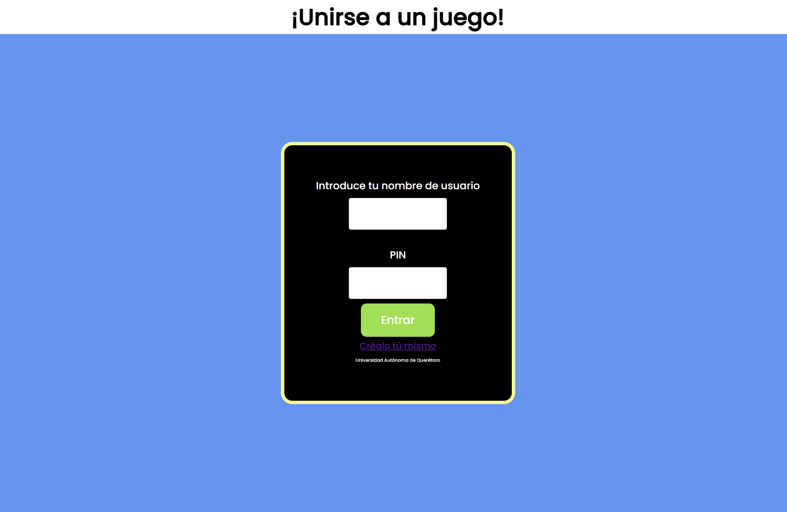
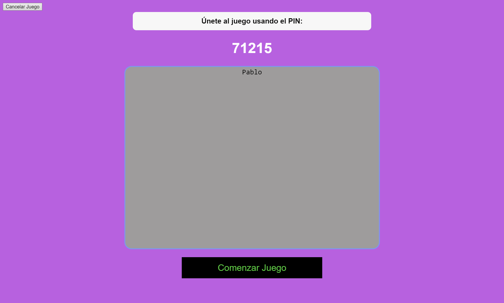
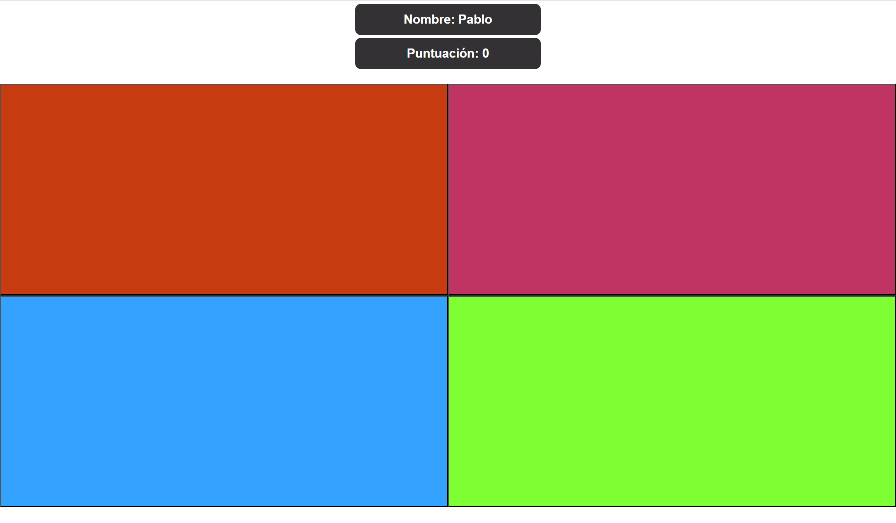
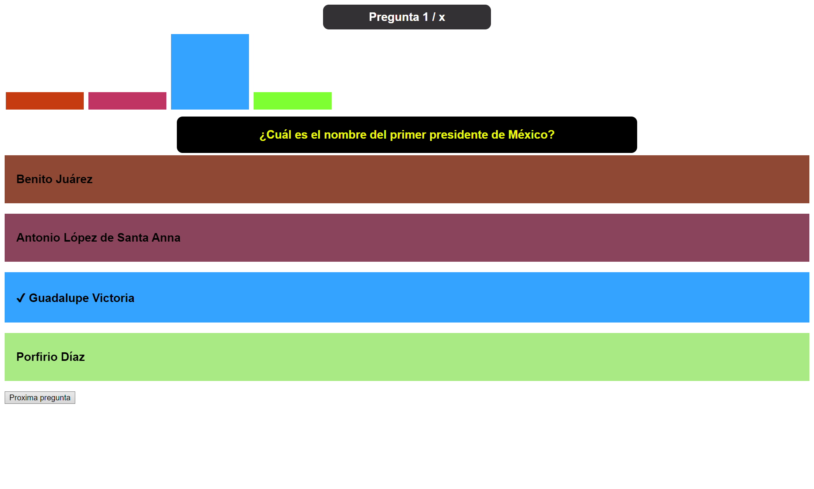
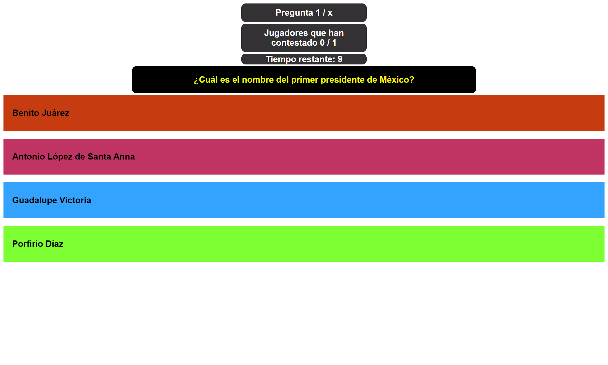
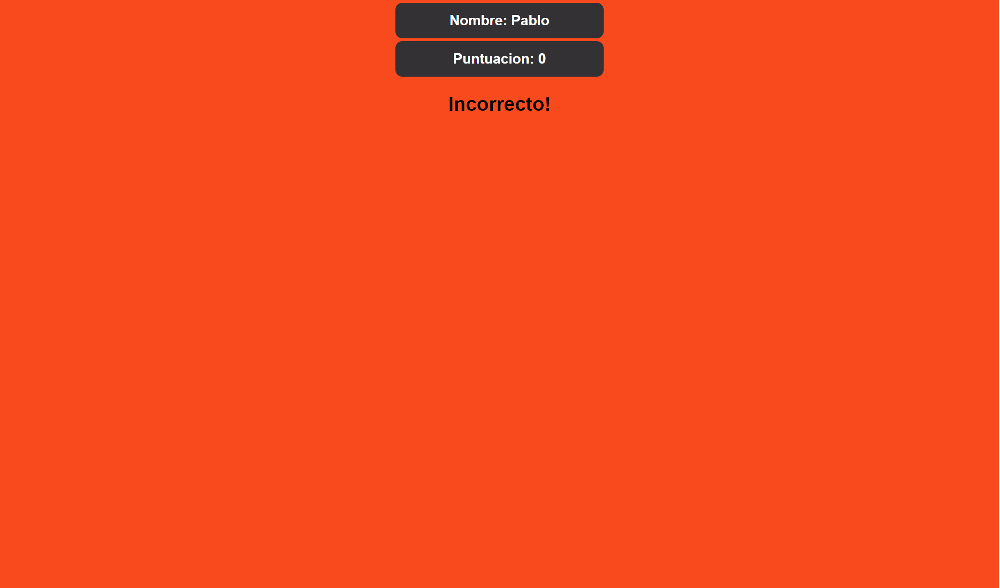

# kahoot-clone-nodejs
<h3>Instrucciones:</h3>
<ol>
  <li>Instalar MongoDB 4.0.28(https://www.mongodb.com/try/download/community)</li>
  <li>Iniciar MongoDB: 'mongod'</li>
  <li>Asegurate de instalar todas los paquetes que están listados en el package.json: express, moment, mongodb, mongoose, socket.io</li>
  <li>Iniciar servidor: 'node server/server.js',  si tienes nodemon: npm start  </li>
</ol>
 
<h3>Descripción:</h3>
<h5>Este es un clon de Kahoot utilizando nodejs y mongoDB</h5>
<h5>Multiples juegos pueden funcionar a la vez y pueden tener varios jugadores</h5>
<h3>Screenshots:</h3>

